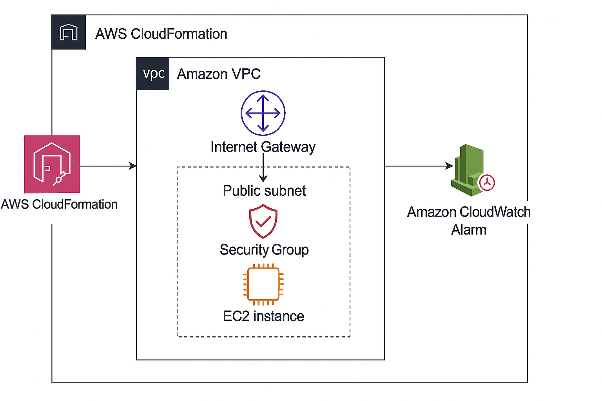
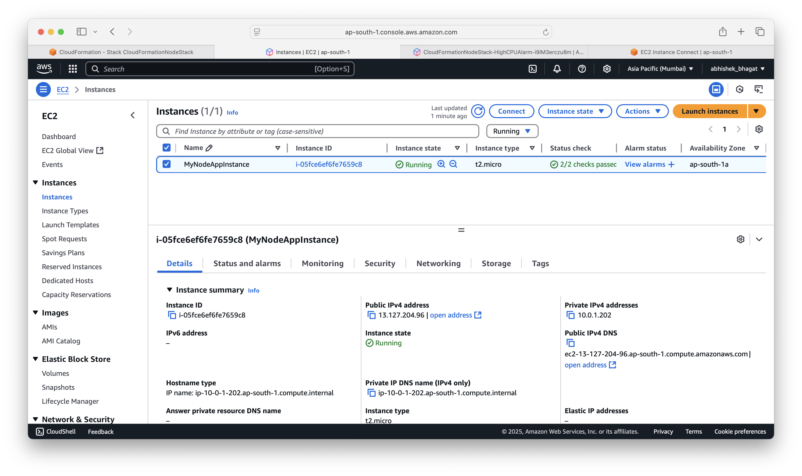
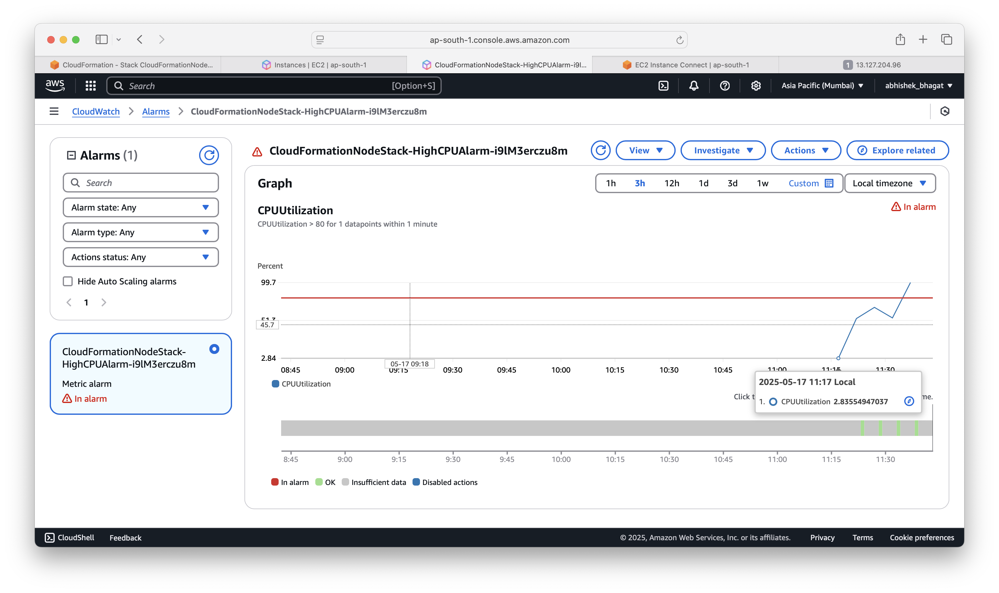

# 🏗️ AWS CloudFormation Project: VPC + EC2 + Node.js + CloudWatch Alarm

This project demonstrates **Infrastructure as Code (IaC)** using **AWS CloudFormation** to provision:

- A custom VPC with a public subnet
- An EC2 instance running a Node.js app
- A Security Group for HTTP/SSH access
- A CloudWatch alarm that monitors CPU usage

> ✅ Fully deployable within the AWS Free Tier!

---

## 🚀 Architecture Diagram



---

## 📁 Project Structure

```
cloudformation-vpc-ec2-nodejs/
├── diagrams/
│   └── architecture.png
├── screenshots/
│   ├── vpc-dashboard.png
│   ├── ec2-instance.png
│   └── cloudwatch-alarm.png
├── templates/
│   └── template.yml
└── README.md
```

---

## 📦 Services Used

- **Amazon VPC**: Isolated network environment
- **EC2**: Runs a Node.js web server
- **CloudFormation**: Infrastructure as Code (YAML)
- **CloudWatch**: Alarm on EC2 CPU Utilization
- **SSM**: For fetching latest Amazon Linux 2 AMI
- **IAM**, **Security Groups**, **Route Tables**

---

## 🔧 Setup Instructions

### 1. Create EC2 Key Pair

Before launching the stack:

1. Go to **EC2 > Key Pairs > Create key pair** in the AWS Console.
2. Name it (e.g., `my-keypair`).
3. Save the `.pem` file to your machine.
4. This will be referenced in the stack’s `KeyName` parameter.

### 2. Deploy CloudFormation Stack

**Option 1: AWS CLI**

```sh
aws cloudformation create-stack \
    --stack-name MyVpcNodeApp \
    --template-body file://templates/vpc-ec2-nodejs.yml \
    --parameters ParameterKey=KeyName,ParameterValue=my-keypair \
    --capabilities CAPABILITY_NAMED_IAM
```

**Option 2: AWS Console**

1. Go to **CloudFormation → Create Stack**.
2. Upload `vpc-ec2-nodejs.yml`.
3. Enter the key pair name when prompted.
4. Launch the stack.

---

## 🧪 Testing the Node.js App

Once the EC2 instance is deployed, run:

```sh
curl http://<Public-IP>
```

**Expected Output:**
```
Hello from Node.js!
```

---

## 🔥 Simulate High CPU Load

SSH into the EC2 instance:

```sh
ssh -i my-keypair.pem ec2-user@<Public-IP>
```

Install `stress` and run:

```sh
sudo yum install -y stress
stress --cpu 1 --timeout 600
```

Or run a manual load loop:

```sh
while true; do :; done &
while true; do :; done &
while true; do :; done &
```

This will push CPU utilization over 80%, triggering the CloudWatch Alarm.

---

## 📸 Screenshots

| Resource         | Screenshot                        |
|------------------|-----------------------------------|
| VPC Console      |          |
| EC2 Instance     |           |
| Alarm Triggered  |     |

---

## 📄 Project Report (PDF)

👉 [CloudFormation + VPC + EC2 + NodeJS + CloudWatch Alarm (PDF)](./cloudformation-vpc-ec2-nodejs-cloudwatchalarm.pdf)